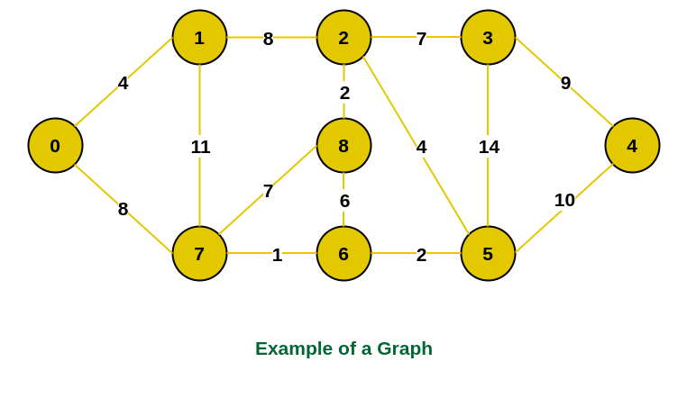
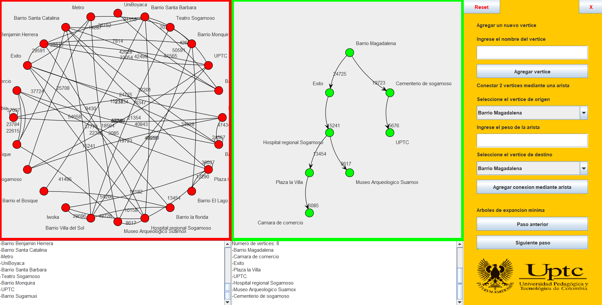

# Minimum Spanning Tree (MST) and Graph Manipulation Project

## Table of Contents
1. [Introduction](#introduction)
2. [Features](#features)
3. [System Requirements](#system-requirements)
4. [Installation and Usage](#installation-and-usage)
5. [Example Usage](#example-usage)
6. [Images](#images)
   - [Graph to Minimum Spanning Tree (MST)](#graph-to-minimum-spanning-tree-mst)
   - [System Interface](#application-user-interface)
7. [Credits and Acknowledgments](#credits-and-acknowledgments)
8. [License](#license)

---

## Introduction
This project demonstrates the transformation of a graph into a Minimum Spanning Tree (MST) using Prim's algorithm. It was developed as an academic project to understand and implement MST concepts, with data derived from key locations in Sogamoso, Colombia.

Key objectives:
- Traverse all nodes in a graph at the minimum possible cost.
- Provide tools to modify the graph by adding nodes or resetting it entirely.

## Features
- **Graph Representation**: Utilizes adjacency lists for efficient graph manipulation.
- **MST Algorithm**: Implements Prim's algorithm to generate the MST.
- **Data Input**: Graph data is preloaded or entered manually (no file upload support).
- **Interactive UI**: Simple interface for modifying and viewing the graph.

## System Requirements
- **Java Version**: JDK 17 or higher (developed using JRE 15, compatible with JDK 17).
- **Development Tools**:
  - Eclipse or IntelliJ (recommended for ease of setup).
  - Alternatively, execute via console:
    1. Navigate to the repository.
    2. Go to `src/Execution`.
    3. Run `Runner.java`.

## Installation and Usage
1. Clone the repository:
   ```bash
   git clone https://github.com/Daga321/Arboles-de-expansion-minima.git
   ```
2. Open the project in your preferred IDE (Eclipse/IntelliJ).
3. Ensure your Java version meets the requirements.
4. Run the application by executing the `Runner.java` file under the `Execution` package.

## Example Usage
Upon running the application, you can:
- View the default graph based on Sogamoso.
- Add new nodes or reset the graph.
- Generate the MST using Prim's algorithm.

## Images

### Graph to Minimum Spanning Tree (MST)


*The images used to create this GIF are sourced from [GeeksforGeeks](https://www.geeksforgeeks.org/prims-minimum-spanning-tree-mst-greedy-algo-5/). All rights belong to their respective owner.*

### Application User Interface



## Credits and Acknowledgments
Special thanks to **Ngadde**, the author of the original implementation of Prim's algorithm and the classes `Edge`, `Graphs`, and `Vertex`. The original code is available at the following repository:

[github.com/ngadde/Algorithms-1](https://github.com/ngadde/Algorithms-1)

The repository is licensed under the MIT license.

## License
This project is licensed under the [MIT License](LICENSE). You are free to use, modify, and distribute this project for non-commercial purposes while providing appropriate credit to the original author and contributors. See the `LICENSE` file for details.
